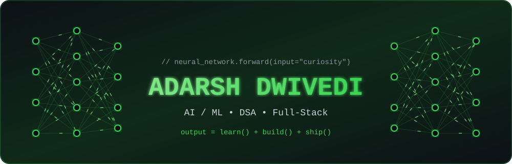
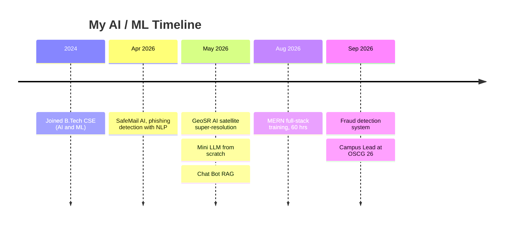
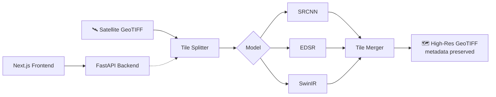

<p align="center">
  
</p>

<p align="center">
  
</p>

<p align="center">
  
  
  
</p>

---

## 🧬 Model Card

| Field | Value |
|---|---|
| **Model name** | Adarsh-2026 |
| **Architecture** | B.Tech CSE (AI & ML), Rungta College of Engineering and Technology, Bhilai |
| **Training window** | Sept 2024 → June 2028 |
| **Specialisations** | Machine Learning, LLMs & RAG, Computer Vision, Full-Stack |
| **Fine-tuned on** | DSA (Java), PyTorch, FastAPI, Next.js, MERN |
| **Deployed role** | Campus Lead, Open Source Connect Global '26 |
| **Currently training on** | Transformers, advanced DSA, MERN stack |
| **Loss function** | `bugs + procrastination` → minimise 📉 |

---

## 🖥️ Training Log

```text
$ python train.py --model adarsh --data projects --epochs 2026

Epoch [Apr 2026]  SafeMail AI ........... phishing detector     ✔ done
Epoch [May 2026]  GeoSR - AI ............ super-resolution      ✔ done
Epoch [May 2026]  Mini LLM .............. transformer scratch   ✔ done
Epoch [May 2026]  Chat Bot RAG .......... retrieval + LLM       ✔ done
Epoch [Aug 2026]  Digital Frontier ...... MERN, 60 hrs          ✔ done
Epoch [Sep 2026]  Fraud Detection ....... anomaly detection     ✔ done
Epoch [Sep 2026]  OSCG '26 .............. Campus Lead           ✔ selected

status: still training... accuracy improving every day 📈
```

---

## 🗺️ Learning Journey



---

## 🛰️ Flagship: GeoSR – AI Pipeline



---

## 🔥 Experiments

<table>
  <tr>
    <td width="50%" valign="top">
      <h3>🧠 Mini LLM From Scratch</h3>
      Character-level language model on WikiText-2: tokenization, embeddings, transformer attention, text generation.<br><br>
      
      
    </td>
    <td width="50%" valign="top">
      <h3>💬 Chat Bot RAG</h3>
      Retrieval-Augmented Generation with semantic search and vector embeddings for context-aware answers.<br><br>
      
      
    </td>
  </tr>
  <tr>
    <td width="50%" valign="top">
      <h3>📧 SafeMail AI</h3>
      Phishing email detector using TF-IDF + Logistic Regression, with a real-time prediction UI.<br><br>
      
      
    </td>
    <td width="50%" valign="top">
      <h3>💳 Fraud Detection</h3>
      Fake payment detection: preprocessing, feature analysis and classification models.<br><br>
      
      
    </td>
  </tr>
</table>

<p align="center">
  <a href="https://github.com/dwivediadarsh496-commits/DSA-WITH-ADARSH">
    
  </a>
  <a href="https://github.com/dwivediadarsh496-commits/SIH-2026-CodeNove">
    
  </a>
</p>

---

## ⚡ Tech Stack

<p align="center">
  
</p>

<p align="center">
  
  
  
  
</p>

<p align="center">
  <code>Linear Regression</code> <code>Logistic Regression</code> <code>KNN</code> <code>Decision Tree</code> <code>Random Forest</code> <code>SVM</code> <code>K-Means</code> <code>Q-Learning</code> <code>Transformers</code>
</p>

---

## 🏆 Certifications

| Certificate | Issuer |
|---|---|
| Introduction to Machine Learning Operations | Microsoft AI Classroom |
| Data Science AI/ML | Coding Spoon |
| Prompt Design in Vertex AI | Google Cloud |
| Contributor Certificate | Open Source Connect Global 2026 |
| 8+ AI learning certificates and 30+ Microsoft learning badges | Various |

<p align="center">
  
</p>

---

## 📊 GitHub Analytics

<p align="center">
  
  
</p>

<p align="center">
  
</p>

### 🟩 Contribution Graph (green dots)

<p align="center">
  
</p>

<p align="center">
  
</p>

### 🐍 Snake

<p align="center">
  <picture>
    <source media="(prefers-color-scheme: dark)" srcset="https://raw.githubusercontent.com/dwivediadarsh496-commits/dwivediadarsh496-commits/output/github-snake-dark.svg" />
    <source media="(prefers-color-scheme: light)" srcset="https://raw.githubusercontent.com/dwivediadarsh496-commits/dwivediadarsh496-commits/output/github-snake.svg" />
    
  </picture>
</p>

---

## 📫 Connect

<p align="center">
  <a href="https://www.linkedin.com/in/YOUR-LINKEDIN"></a>
  <a href="mailto:dwivediadarsh496@gmail.com"></a>
  <a href="https://leetcode.com/u/YOUR-LEETCODE"></a>
  <a href="https://www.youtube.com/@YOUR-CHANNEL"></a>
</p>

<p align="center"><i>🧠 "The best model is the one that keeps learning." ⭐</i></p>


